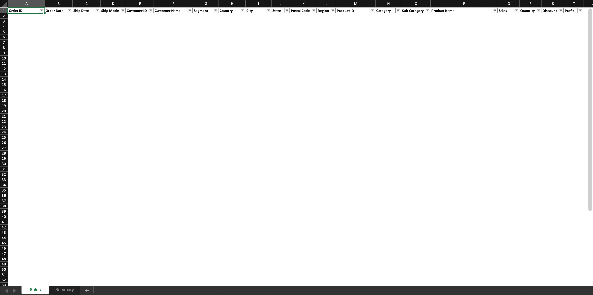
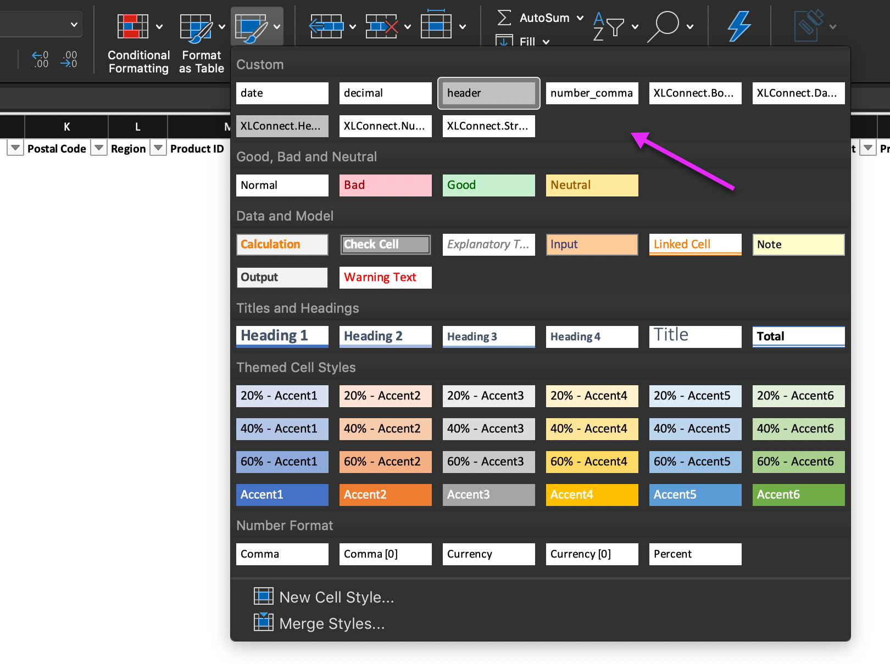
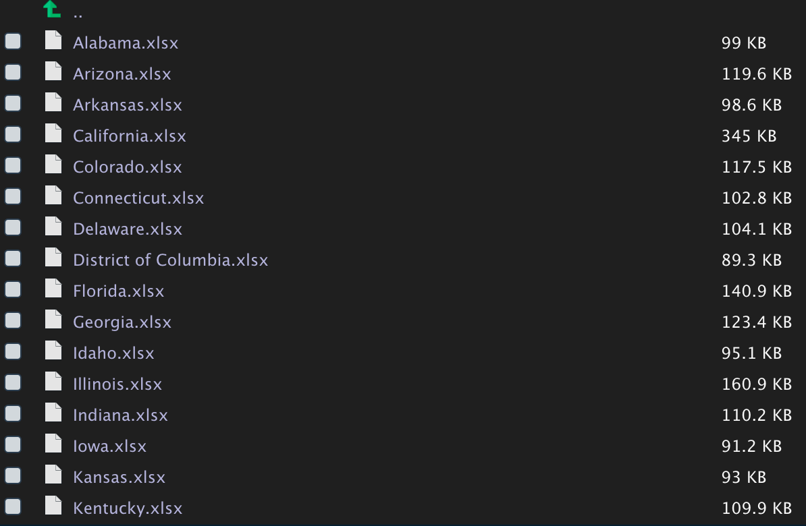
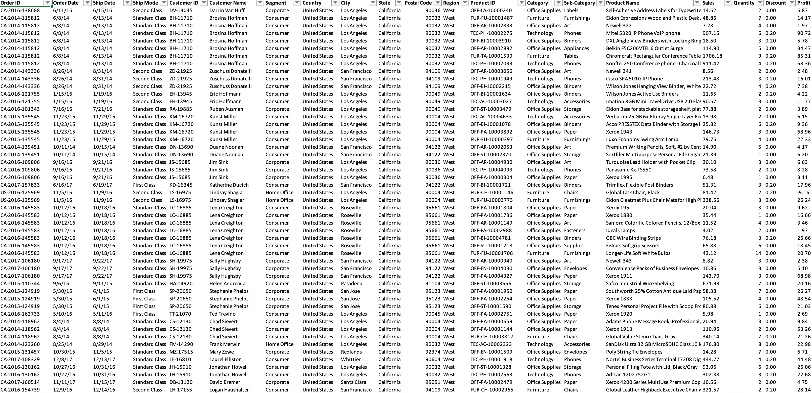
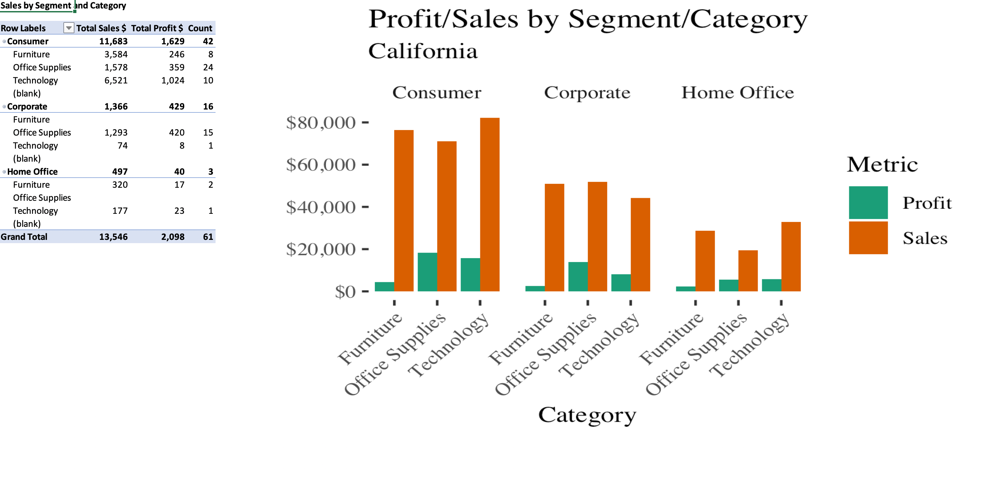

```{r setup, include=FALSE}
options(htmltools.dir.version = FALSE)
knitr::opts_chunk$set(fig.retina = 3, warning = FALSE, message = FALSE)

# Set Java location for rjava. 
# This is required for mailR package. You will need to go to here to download latest Java
# https://java.com/en/download/

library(tidyverse)
library(glue)
library(furrr)
library(DT)
```

```{r eval=FALSE, echo=FALSE}
Sys.setenv(JAVA_HOME = "C:\\Program Files\\Java\\jdk1.8.0_102")
library(XLConnect)
library(sendmailR)
```


---

# Your boss wants 49 Excel sheets, but why?


---

# Data dump

```{r Data, echo=FALSE}
# https://community.tableau.com/docs/DOC-1236
people_data <- readxl::read_excel("Sample - Superstore.xls", sheet = 3)

sales_data <- readxl::read_excel("Sample - Superstore.xls", sheet = 1) %>% 
  select(-`Row ID`) %>% 
  left_join(people_data, "Region") %>% 
  select(Person, everything())

sales_split <- sales_data %>% 
  split(.$State)
```

```{r Show-data}
sales_data
```


---

class: middle center


.footnote[XLConnect created by Mirai Solutions GmbH]

---

# Excel interface

What can XLConnect do?

--

- Create/load Excel workbooks

--

- Add/read data from Excel

--

- Format worksheets (some limitations)

--

- Include images

--

- And much more... see [here](https://cran.r-project.org/web/packages/XLConnect/XLConnect.pdf)

--

All programatically!

---

class: middle center, inverse

# Make a template



---

class: middle center, inverse

# Create cell styles



---

# Load/create workbook and styles

```{r eval=FALSE}
wb <- loadWorkbook("template.xlsx")
```

```{r eval=FALSE}
date_cellstyle <- getCellStyle(wb, "date")
num_comma_cellstyle <- getCellStyle(wb, "number_comma")
dec_cellstyle <- getCellStyle(wb, "decimal")

setStyleAction(wb, XLC$STYLE_ACTION.NONE)
```

---

# Write data/format data

```{r eval=FALSE}
writeWorksheet(wb, data = data,
               sheet_name,
               startRow = 2,
               header = FALSE)

walk(
  2:(row_count + 1),
  ~ setCellStyle(
    wb,
    sheet = sheet_name,
    row = .x,
    col = 2:3,
    cellstyle = date_cellstyle
  )
)

walk(
  2:(row_count + 1),
  ~ setCellStyle(
    wb,
    sheet = sheet_name,
    row = .x,
    col = c(sales, discount, profit),
    cellstyle = num_comma_cellstyle
  )
)
```

---

# Add a plot to Excel

```{r eval=FALSE}
createName(wb, "plot", formula = glue("Summary!{idx2cref(c(1, 6))}") %>% as.character())

p <- data %>%
  group_by(Segment, Category) %>% 
  summarise_if(is.numeric, ~ sum(.x, na.rm = TRUE)) %>% 
  gather(key = key, value = value, -c("Segment", "Category", "Postal Code")) %>% 
  filter(!key %in% c("Quantity", "Discount")) %>% 
  ggplot(aes(Category, value, fill = key)) +
  geom_col(position = "dodge") +
  scale_fill_brewer(name = "Metric", type = "qual", palette = 2) +
  scale_y_continuous(label = scales::comma) +
  facet_wrap( ~ Segment) +
  ggthemes::theme_tufte() +
  theme(axis.text.x = element_text(angle = 45, hjust = 1)) +
  labs(title = "Profit/Sales by Segment/Category",
       y = NULL)

ggsave(p, filename = "segment-category.png", width = 4, height = 3)

addImage(wb, filename = "segment-category.png", name = "plot", originalSize = TRUE)

saveWorkbook(wb, file = file_name)
```

---

```{r echo=FALSE, eval=FALSE}
style <- function(wb, cell_style, column, row_count, sheet_name) {
    walk(2:(row_count + 1), ~ setCellStyle(wb, sheet = sheet_name, row = .x, col = column, cellstyle =
                                           cell_style))
}

make_plot <- function(data, file_name) {
    p <- data %>%
    group_by(Segment, Category) %>% 
    summarise_if(is.numeric, ~ sum(.x, na.rm = TRUE)) %>% 
    gather(key = key, value = value, -c("Segment", "Category", "Postal Code")) %>% 
    filter(!key %in% c("Quantity", "Discount")) %>% 
    ggplot(aes(Category, value, fill = key)) +
    geom_col(position = "dodge") +
    scale_fill_brewer(name = "Metric", type = "qual", palette = 2) +
    scale_y_continuous(label = scales::dollar) +
    facet_wrap( ~ Segment) +
    ggthemes::theme_tufte() +
    theme(axis.text.x = element_text(angle = 45, hjust = 1)) +
    labs(title = "Profit/Sales by Segment/Category",
         subtitle = data$State[[1]],
         y = NULL)
    
  ggsave(p, filename = file_name, width = 4, height = 3)
}

build_excel <- function(data, wb, directory = "reports", plot_file_name = "segment-category.png") {
  if (!dir.exists(directory)) {
    dir.create(directory)
  }
  
  file_name <- glue("{data$State[[1]]}.xlsx") %>% as.character()
  sheet_name <- "Sales"
  column_count <- ncol(data)
  row_count <- nrow(data)

  data <- data %>% 
    select(-Person)

  wb <- loadWorkbook("template.xlsx")

  date_cellstyle <- getCellStyle(wb, "date")
  num_comma_cellstyle <- getCellStyle(wb, "number_comma")
  dec_cellstyle <- getCellStyle(wb, "decimal")

  sales <- data %>% names %>% str_detect("Sales") %>% which()
  discount <- data %>% names %>% str_detect("Discount") %>% which()
  profit <- data %>% names %>% str_detect("Profit") %>% which()
  quantity <- data %>% names %>% str_detect("Quantity") %>% which()

  setStyleAction(wb, XLC$STYLE_ACTION.NONE)

  writeWorksheet(wb, data = data, sheet_name, startRow = 2, header = FALSE)

  style(
    wb = wb,
    cell_style = date_cellstyle,
    column = 2:3,
    row_count = row_count,
    sheet_name = sheet_name
  )
  
  style(
    wb = wb,
    cell_style = dec_cellstyle,
    column = c(sales, discount, profit),
    row_count = row_count,
    sheet_name = sheet_name
  )
  
  style(
    wb = wb,
    cell_style = num_comma_cellstyle,
    column = quantity,
    row_count = row_count,
    sheet_name =
      sheet_name
  )
  
  make_plot(data, plot_file_name)
  
  createName(wb, "plot", formula = glue("Summary!{idx2cref(c(1, 6))}") %>% as.character())
  
  addImage(wb, filename = plot_file_name, name = "plot", originalSize = TRUE)

  saveWorkbook(wb, file = glue("{directory}/{file_name}"))
  
  invisible(file.remove(plot_file_name))
}
```

# Functional

```{r eval=FALSE}
make_plot()

style()

build_excel()
```

--

```{r eval=FALSE}
walk(sales_split, function(split) {
  build_excel(split, "reports")
})
```

--

```{r eval=FALSE}
plan(multiprocess)
furrr::future_map(sales_split, ~ build_excel(.x, "reports"))
```

---

class: middle center



---

class: middle center



---

class: middle center



---

# Compose a message

```{r eval=FALSE}
subject = "Sales State Coverage Report"

msg <- paste0(
  '<!DOCTYPE html PUBLIC "-//W3C//DTD XHTML 1.0
Strict//EN" "http://www.w3.org/TR/xhtml1/DTD/xhtml1-strict.dtd">
<html xmlns="http://www.w3.org/1999/xhtml">
<head>
  <meta http-equiv="Content-Type" content="text/html; charset=utf-8" />
  <meta name="viewport" content="width=device-width, initial-scale=1.0"/>
  <title>Sales Coverage</title>
  <style type="text/css">
  </style>
</head>
<body>
    Hello,
</p>
<p>Attached is sales data for your state coverage.</p>
<p>A visualization and summary are available on the second tab.</p>
<p>Let us know if you have questions.</p>
<p>Kind regards,</p>
<p>Analysis Group,</p>
</body>
</html>'
)
```

---

# mailR/sendmailR

```{r eval=FALSE}
send.mail(
  from = "user@domain.com",
  to = "user@domain.com",
  subject = subject,
  body = msg,
  html = TRUE,
  smtp = list(
    host.name = "smtp.gmail.com",
    port = 465,
    user.name = rstudioapi::askForPassword(),
    passwd = rstudioapi::askForPassword(),
    ssl = TRUE
  ),
  attach.files = "file_path",
  authenticate = TRUE,
  send = TRUE
)
```

---

# Nice to know

- Java/rJava are required to use XLConnect and mailR/sendmailR.

- Latest version of java: https://java.com/en/download/.

- If you have trouble installing Java on Mac, see https://www.chrisjmendez.com/2018/11/16/installing-xlconnect-and-rjava-on-macos/.

- It's typically required you set your JAVA_HOME, such as `Sys.setenv(JAVA_HOME = "C:\\Program Files\\Java\\jdk1.8.0_102")`. The path is relative to your machine, so you must locate your directory and version of Java.

- Useful: `vignette("XLConnect")`.

- XLConnect runs on memory until `saveWorkbook()` is called. If you experience out-of-memory errors, try allocating more memory with `options(java.parameters = "-Xmx1024m")`. See vignette above.


